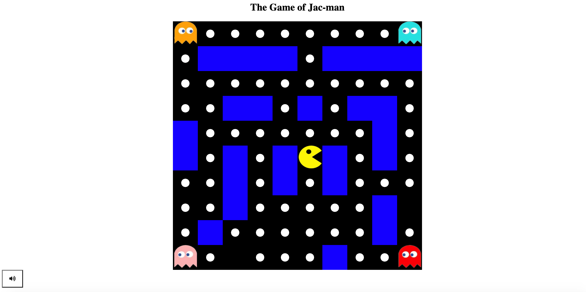

# Jac-Man
Jay's Pac-Man

Classic game of Pac-man.
#
##### User is able to move around the pac-man all directions: up,down,left,right. 
##### 4 individual computer(AI) pacs will calculate the User's coordinates and follow the User. 
##### Each Map(grid style board) will be mazed and walled(blocked so user or the AI cannot go through).
#
##### Winning condition for every stage would be collecting all the dots(points) on the map.
##### Losing condition would be dying out of lives given(3 at default).***ONLY IMPLEMENTED 1 LIFE YET
#
##### Clearing the whole set of stages will be the ultimate win condition for the whole game.

## CLICK THIS LINK TO PLAY

  

